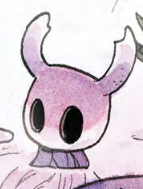

# Image to ASCII converter Discord bot

A discord bot that turns images into ASCII art as a message or as a file.

*Invite link*: https://discord.com/oauth2/authorize?client_id=1297538628586705008



If the format is chosen as message:

```
                                           .          
                                          .           
              :----                                -. 
           .-=:.  -                                :=-
          --.    .-                            ..   --
         :-  .   .=.                           -:-   :
        :=...   .-.                           .: .-   
        =:.... :-                          -:::   :-  
       .+..... =.                          =...    ++=
       :+.:.:..+.                         .=  .... +++
       .*-:::..=+                         -- .... .+==
        -#-:::::+=:.:....                .= ......-..:
         -*-:::::-======+++=-:.         :=..:--::--   
          :*+-:-------------=+++==:.   -=::--:-:=-    
            =*:::::----:----------=++=+=-------=-     
           .+=-:-::::-::::::::-------=-------++:      
          .+-::::::::::-:::::::-----------=++-.       
          =-.::::::::::--:-----:-------==*=:          
         -+:-+*=:::::::::::::--::--::::--*.           
        .+.-*#@@=.:::::-:=++=-::::-::::::*.           
        -= +*%%@*::::::-*#@@@%+::::::::::*            
        -: +*%%%#::::::+#@@@@@@=:::::::.-+            
        :: -+%%%#:::::=*%@@@@@@+:::::.. +-            
:.      .- :=*%%=...::**@@@@@@@=::.... -+             
:::::.   :- .-=-......+*%@@@@@%..     :+.        .....
....-.    :-:         .+#@@@@#:     .-=.         .::::
::::.       .--:.       :+*+-. ...:-=-        ...  ...
 ......       -+++==----::-:--==-=-.                  
.........    :=--==*+===+**#+++*-                     
..         .-=-::::==----+-+*=-=*-                    
      .    -=-----===+===+==**+++=              .     
    .::   ..:.......::::---------. .. .        ....   
  .::...::::::.....:: :....:....:  :-:..::----==+++===
..:....--:......::-:..::-:::..:-=-=++**+++++=====-----
:.....::.....::-:....:-:-.-:-+*##**+++==-----=--------
```

**Formats**: `message` / `file`

`message` will make sure that the size of the ascii art won't exceed 2000 characters and paste it into a code field and send it to channel.

`file` will prompt you for the width character size for the art then it will send the file in the channel.

## 🤝 Contributing